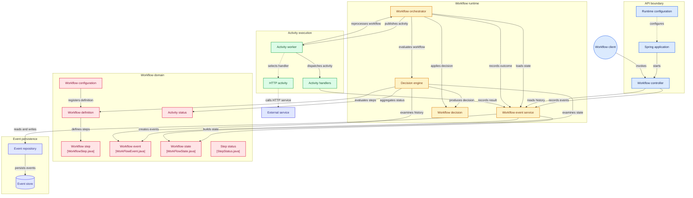

```mermaid
flowchart TD

subgraph group_api["API boundary"]
  node_application["Spring application"]
  node_controller["Workflow controller"]
  node_runtime_config["Runtime configuration"]
end

subgraph group_runtime["Workflow runtime"]
  node_orchestrator["Workflow orchestrator"]
  node_event_service["Workflow event service"]
  node_decision_engine["Decision engine"]
  node_decision["Workflow decision"]
end

subgraph group_activity["Activity execution"]
  node_worker_listener["Activity worker"]
  node_activity_handler["Activity handlers"]
  node_http_handler["HTTP activity"]
end

subgraph group_domain["Workflow domain"]
  node_configuration["Workflow configuration"]
  node_definition["Workflow definition"]
  node_step["Workflow step<br/>[WorkflowStep.java]"]
  node_event["Workflow event<br/>[WorkFlowEvent.java]"]
  node_state["Workflow state<br/>[WorkFlowState.java]"]
  node_activity_status["Activity status"]
  node_step_status["Step status<br/>[StepStatus.java]"]
end

subgraph group_persistence["Event persistence"]
  node_repository["Event repository"]
  node_store[("Event store")]
end

node_client(("Workflow client"))
node_external_service["External service"]

node_application -->|"starts"| node_controller
node_runtime_config -.->|"configures"| node_application
node_client -->|"invokes"| node_controller
node_controller -->|"records events"| node_event_service
node_controller -->|"reads history"| node_event_service
node_event_service -->|"reads and writes"| node_repository
node_repository -->|"persists events"| node_store
node_event_service -->|"creates events"| node_event
node_event_service -->|"builds state"| node_state
node_configuration -->|"registers definition"| node_definition
node_definition -->|"defines steps"| node_step
node_orchestrator -->|"loads state"| node_event_service
node_orchestrator -->|"evaluates workflow"| node_decision_engine
node_decision_engine -->|"examines state"| node_state
node_decision_engine -->|"examines history"| node_event
node_decision_engine -->|"evaluates steps"| node_definition
node_decision_engine -->|"aggregates status"| node_activity_status
node_decision_engine -->|"produces decision"| node_decision
node_orchestrator -->|"applies decision"| node_decision
node_orchestrator -->|"records outcome"| node_event_service
node_orchestrator -->|"publishes activity"| node_worker_listener
node_worker_listener -->|"dispatches activity"| node_activity_handler
node_activity_handler -->|"records result"| node_event_service
node_worker_listener -->|"reprocesses workflow"| node_orchestrator
node_http_handler -.->|"calls HTTP service"| node_external_service
node_worker_listener -.->|"selects handler"| node_http_handler

click node_application "https://github.com/peekayyychu/workflow-engine/blob/main/src/main/java/com/engine/WorkflowEngineApplication.java"
click node_controller "https://github.com/peekayyychu/workflow-engine/blob/main/src/main/java/com/engine/controller/WorkFlowController.java"
click node_runtime_config "https://github.com/peekayyychu/workflow-engine/blob/main/src/main/resources/application.properties"
click node_orchestrator "https://github.com/peekayyychu/workflow-engine/blob/main/src/main/java/com/engine/service/WorkFlowOrchestrator.java"
click node_event_service "https://github.com/peekayyychu/workflow-engine/blob/main/src/main/java/com/engine/service/WorkFlowEventService.java"
click node_decision_engine "https://github.com/peekayyychu/workflow-engine/blob/main/src/main/java/com/engine/service/WorkFlowDecisionEngine.java"
click node_decision "https://github.com/peekayyychu/workflow-engine/blob/main/src/main/java/com/engine/service/WorkFlowDecision.java"
click node_worker_listener "https://github.com/peekayyychu/workflow-engine/blob/main/src/main/java/com/engine/activity/ActivityWorkerListener.java"
click node_activity_handler "https://github.com/peekayyychu/workflow-engine/blob/main/src/main/java/com/engine/activity/ActivityHandler.java"
click node_http_handler "https://github.com/peekayyychu/workflow-engine/blob/main/src/main/java/com/engine/activity/HttpActivityHandler.java"
click node_configuration "https://github.com/peekayyychu/workflow-engine/blob/main/src/main/java/com/engine/registry/WorkflowConfiguration.java"
click node_definition "https://github.com/peekayyychu/workflow-engine/blob/main/src/main/java/com/engine/model/WorkflowDefinition.java"
click node_step "https://github.com/peekayyychu/workflow-engine/blob/main/src/main/java/com/engine/model/WorkflowStep.java"
click node_event "https://github.com/peekayyychu/workflow-engine/blob/main/src/main/java/com/engine/model/WorkFlowEvent.java"
click node_state "https://github.com/peekayyychu/workflow-engine/blob/main/src/main/java/com/engine/model/WorkFlowState.java"
click node_activity_status "https://github.com/peekayyychu/workflow-engine/blob/main/src/main/java/com/engine/model/enums/ActivityStatus.java"
click node_step_status "https://github.com/peekayyychu/workflow-engine/blob/main/src/main/java/com/engine/model/enums/StepStatus.java"
click node_repository "https://github.com/peekayyychu/workflow-engine/blob/main/src/main/java/com/engine/repository/WorkFlowEventRepository.java"

classDef toneNeutral fill:#f8fafc,stroke:#334155,stroke-width:1.5px,color:#0f172a
classDef toneBlue fill:#dbeafe,stroke:#2563eb,stroke-width:1.5px,color:#172554
classDef toneAmber fill:#fef3c7,stroke:#d97706,stroke-width:1.5px,color:#78350f
classDef toneMint fill:#dcfce7,stroke:#16a34a,stroke-width:1.5px,color:#14532d
classDef toneRose fill:#ffe4e6,stroke:#e11d48,stroke-width:1.5px,color:#881337
classDef toneIndigo fill:#e0e7ff,stroke:#4f46e5,stroke-width:1.5px,color:#312e81
classDef toneTeal fill:#ccfbf1,stroke:#0f766e,stroke-width:1.5px,color:#134e4a
class node_application,node_controller,node_runtime_config,node_client toneBlue
class node_orchestrator,node_event_service,node_decision_engine,node_decision toneAmber
class node_worker_listener,node_activity_handler,node_http_handler toneMint
class node_configuration,node_definition,node_step,node_event,node_state,node_activity_status,node_step_status toneRose
class node_repository,node_store,node_external_service toneIndigo
```